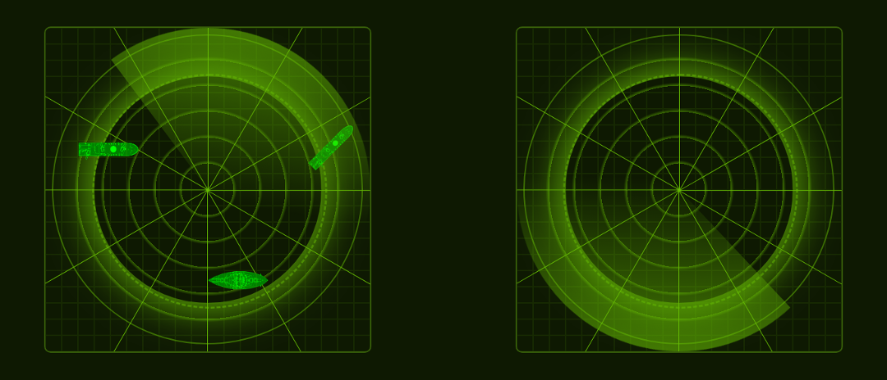

# Naval Battle Game | JavaScript/C++ version

The Naval Battle board game is a classic, so I thought that it would be a good choice for improving my programming skills in JavaScript and C++, since video game algorithms tend to be very demanding, plus are more fun.

This is a Work In Progress, and is about using JavaScript patterns and understanding the subtleties and the core concepts of the language, like the prototype chain, context vs scope, and prototype-based programming, and not that much about using tools that make building video games easier, like libraries or the Canvas API, for example, which is great for creating video games but doesn't help with studying JavaScript at a deeper level.

Regarding the server side, it is not yet implemented, and I will use C++ just because I love it and this is a great excuse for using it.

I'm not using any frameworks or libraries on the front end, and besides vanilla JavaScript, everything else is pure HTML5, plain CSS3 and PNG files.

  

## The Game

<picture>
	<source srcset="docs/the-boards-mobile.png 516w" media="(max-width: 600px)">
	
</picture>

When the game starts the browser creates two boards: one board is the player's, with the warships randomly located, and the other board is the enemy's, created with no ships. The game also generates an ID for the player to be used when connecting to the server. For now, it is a 1:1 battle, but there are no obstacles to make it a n:n mayhem!

Then, like in any classic turn-based game, one player fires to their enemies' board by clicking or dragging a missile on a specific cell. The browser sends the cell's coordinates to the server, and the server passes this JSON object to the board under attack in order for it to update. This continues on and on until one player reports all of their ships as being destroyed.

There will be some cool rules, like a variable size of warships and different type of missiles that can cause different levels of damage (by not being limited to one cell only), but for now the rules are the classic rules.

  

## Features

Some features that will be implemented with this version are:

- Horizontal, vertical, diagonal and counterdiagonal warships;
- Two players only;
- Variable amount of ships;
- Variable size of boards;
- Variable size of ships;
- Every time one player loses a warship, she or he also loses the ship's missiles;

  

# Architecture

The Board objects hold all the responsability for creating and painting themselves, besides knowing all the cells that are occupied.

The Ship objects are responsible for holding all the information related to their models, sprites, orientation, missiles, and also for painting themselves.

The server keeps an open connection with (all) the players by using the WebSocket protocol.

  

## Patterns

I expect to have a use for the majority of the patterns, if not for all of them. Some patterns that have been used so far are:

  

### Strategy

The Strategy pattern is used to generate the ships coordinates. First, it is used to switch from a random positioning strategy to a direct positioning strategy. Then, the pattern is used again to choose the right algorithm to calculate the coordinates acording to the orientation.

  

### Namespace

The Namespace pattern is used in the Main.js and Utilities.js. I might change it later for the Sandbox pattern.

  

### Scope-Safe Constructors

Scope-Safe Constructors are used in all the big objects like Board and Game.

  

### Subclassing

For creating different models of warships.

  

### Singleton

The Singleton pattern is used every time we create an object literal.

  

### Mediator
The Mediator pattern is used in order to reduce coupling. For example, Main uses the Game object in order to instantiate the Board objects, the Ship objects and the Player objects, so Game acts as a mediator.
